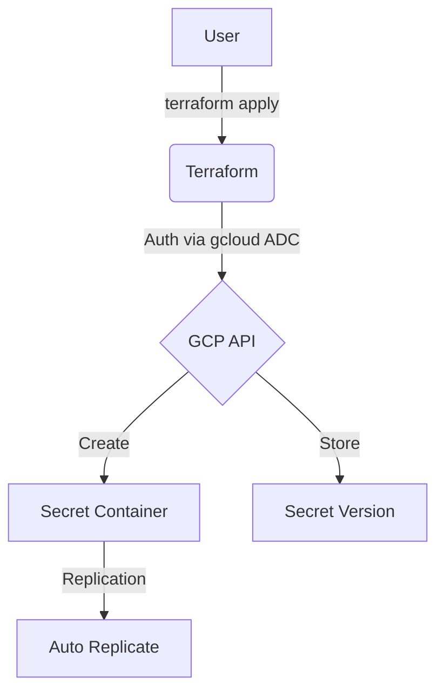
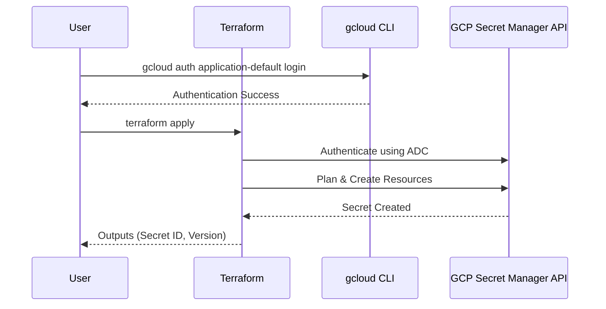

# terraform-gcp-secret-manager

This Terraform project provisions a secret in **Google Cloud Secret Manager**.

## Architecture

### Flowchart


### Sequence Diagram


## Secret Specifications
- **Replication**: Auto-replicated across regions.
- **Secret Data**: Marked as sensitive, never displayed in output.
- **Regions**: All GCP regions supported (Free Tier: `us-west1`, `us-central1`, `us-east1`).

## Prerequisites
1.  **Google Cloud SDK**: [Installed and initialized](https://cloud.google.com/sdk/docs/install).
2.  **Terraform**: [Installed](https://developer.hashicorp.com/terraform/downloads).

## Setup & Deployment

1.  **Enable the Secret Manager API**:
    ```bash
    gcloud services enable secretmanager.googleapis.com
    ```

2.  **Authenticate and Select Project**:
    Instead of using a service account JSON file, this project uses your local `gcloud` credentials.
    ```bash
    # Authenticate
    gcloud auth application-default login

    # Select your project
    gcloud config set project your-project-id
    ```

3.  **Configure Variables**:
    Create a `terraform.tfvars` file based on the example:
    ```hcl
    project_id  = "your-project-id"
    region      = "us-central1"
    secret_id   = "my-api-key"
    secret_data = "your-super-secret-value"
    ```

4.  **Deploy**:
    ```bash
    terraform init
    terraform apply
    ```

## Usage as a Module

Reference this repository as a Terraform module in your own configurations:

```hcl
module "secret_manager" {
  source = "github.com/marcuwynu23/terraform-gcp-secret-manager?ref=main"

  project_id  = var.project_id
  region      = "us-central1"
  secret_id   = "my-api-key"
  secret_data = var.secret_data
}
```

## Variables

| Variable | Description | Type | Default |
|----------|-------------|------|---------|
| `project_id` | GCP project ID | `string` | (required) |
| `region` | GCP region (free tier: us-west1, us-central1, us-east1) | `string` | `"us-central1"` |
| `secret_id` | Secret ID to create | `string` | `"my-api-key"` |
| `secret_data` | Secret data value | `string` | (required) |

## Outputs

| Output | Description |
|--------|-------------|
| `secret_id` | The ID of the created secret |
| `secret_name` | The full resource name of the secret |
| `secret_version` | The version of the created secret |
| `secret_data` | The secret data (sensitive) |
