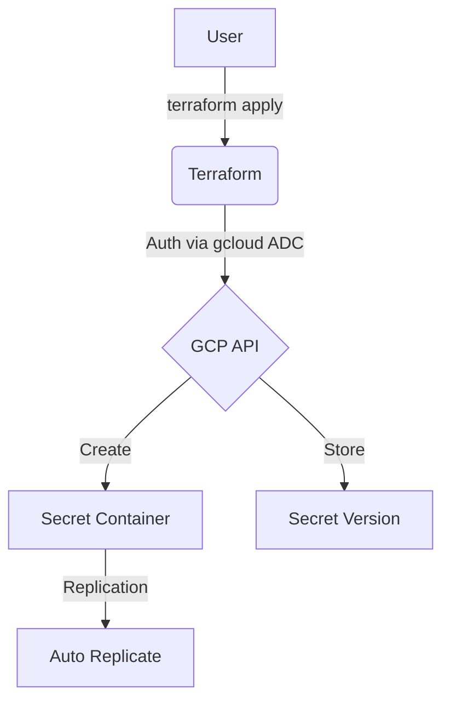
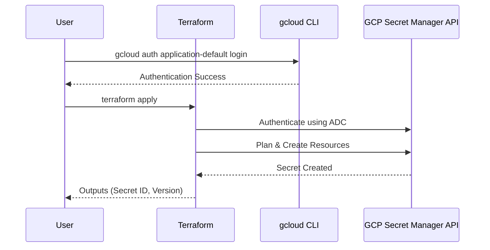

# terraform-gcp-secret-manager

This Terraform project provisions a secret in **Google Cloud Secret Manager**.

## Architecture

### Flowchart


### Sequence Diagram


## Secret Specifications
- **Replication**: Auto-replicated across regions.
- **Secret Data**: Marked as sensitive, never displayed in output.
- **Regions**: All GCP regions supported (Free Tier: `us-west1`, `us-central1`, `us-east1`).

## Prerequisites
1.  **Google Cloud SDK**: [Installed and initialized](https://cloud.google.com/sdk/docs/install).
2.  **Terraform**: [Installed](https://developer.hashicorp.com/terraform/downloads).

## Setup & Deployment

1.  **Enable the Secret Manager API**:
    ```bash
    gcloud services enable secretmanager.googleapis.com
    ```

2.  **Authenticate and Select Project**:
    Instead of using a service account JSON file, this project uses your local `gcloud` credentials.
    ```bash
    # Authenticate
    gcloud auth application-default login

    # Select your project
    gcloud config set project your-project-id
    ```

3.  **Configure Variables**:
    Create a `terraform.tfvars` file based on the example:
    ```hcl
    project_id  = "your-project-id"
    region      = "us-central1"
    secret_id   = "my-api-key"
    secret_data = "your-super-secret-value"
    ```

4.  **Deploy**:
    ```bash
    terraform init
    terraform apply
    ```

## Usage as a Module

Reference this repository as a Terraform module in your own configurations:

> **Option 1**: Terraform Registry (recommended)
> ```hcl
> module "secret-manager" {
>   source  = "marcuwynu23/secret-manager/gcp"
>   version = "1.0.0"
>
>   project_id  = var.project_id
>   region      = "us-central1"
>   secret_id   = "my-api-key"
>   secret_data = var.secret_data
> }
> ```
>
> **Option 2**: GitHub source
> ```hcl
> module "secret-manager" {
>   source = "github.com/marcuwynu23/terraform-gcp-secret-manager?ref=main"
>
>   project_id  = var.project_id
>   region      = "us-central1"
>   secret_id   = "my-api-key"
>   secret_data = var.secret_data
> }
> ```

## Variables

| Variable | Description | Type | Default |
|----------|-------------|------|---------|
| `project_id` | GCP project ID | `string` | (required) |
| `region` | GCP region (free tier: us-west1, us-central1, us-east1) | `string` | `"us-central1"` |
| `secret_id` | Secret ID to create | `string` | `"my-api-key"` |
| `secret_data` | Secret data value | `string` | (required) |

## Outputs

| Output | Description |
|--------|-------------|
| `secret_id` | The ID of the created secret |
| `secret_name` | The full resource name of the secret |
| `secret_version` | The version of the created secret |
| `secret_data` | The secret data (sensitive) |

## Resources Created

- `google_secret_manager_secret.my_secret` – Secret container in Secret Manager
- `google_secret_manager_secret_version.my_secret_version` – Secret version with the actual secret data
## CI/CD Setup (GitHub Actions)

### Prerequisites
1. **Create a GCS bucket** for Terraform remote state:
    ```bash
    gcloud storage buckets create gs://your-terraform-state-bucket \
      --location=us-central1 \
      --uniform-bucket-level-access
    ```

2. **Create a service account** with necessary permissions and generate a JSON key:
    - GCP Console → IAM & Admin → Service Accounts → Create Service Account
    - Grant the required roles for this module
    - Keys → Add Key → Create New Key → JSON
    - Copy the entire JSON file contents

3. **Add GitHub secrets**:

    | Secret Name | Value |
    |---|---|
    | `GCP_SA_KEY` | Full JSON key from step 2 |
    | `TF_BUCKET_NAME` | Your GCS bucket name |
    | `TF_BUCKET_PREFIX` | Bucket prefix/path (e.g., `gcp-secret-manager`) |

4. **Run the workflow**:
    - **Apply**: Go to Actions → **CD - GCP Secret Manager (Apply)** → fill in all inputs
    - **Destroy**: Go to Actions → **CD - GCP Secret Manager (Destroy)** → fill in essential inputs

> Alternatively, create a `backend.tfvars` from `backend.tfvars.example` and run `terraform init -backend-config="backend.tfvars"` for local use.

## Remote State (GCS Backend)

This module uses Google Cloud Storage (GCS) as the Terraform backend for remote state management:

```hcl
terraform {
  backend "gcs" {
    bucket = "your-terraform-state-bucket"
    prefix = "gcp-secret-manager"
  }
}
```

Create a `backend.tfvars` file based on `backend.tfvars.example` and initialize:

```bash
terraform init -backend-config="backend.tfvars"
```

