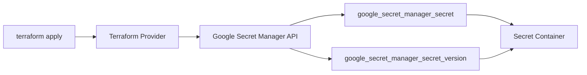
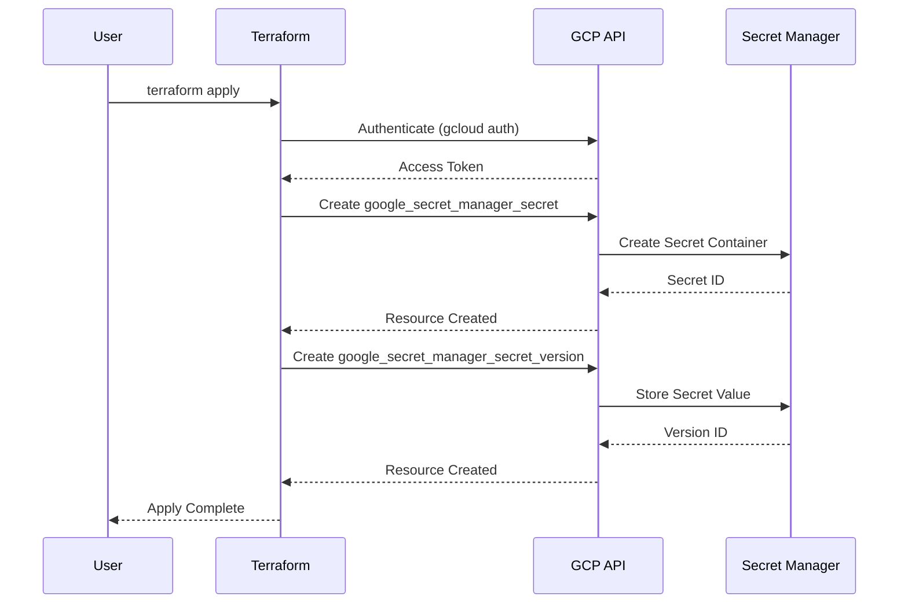

# Google Cloud Secret Manager - Terraform Module

A Terraform module to create and manage secrets in **Google Cloud Secret Manager**.

## Architecture





## Specifications

- Creates a secret container with auto-replication
- Stores the secret value as the first version
- Supports all GCP regions (Free Tier: `us-west1`, `us-central1`, `us-east1`)
- Secret data is marked sensitive and never displayed in output

## Prerequisites

- [Google Cloud SDK](https://cloud.google.com/sdk/docs/install)
- [Terraform](https://developer.hashicorp.com/terraform/install) >= 1.0

## Setup & Deployment

```bash
# Authenticate with Google Cloud
gcloud auth application-default-login

# Set your GCP project
gcloud config set project YOUR_PROJECT_ID

# Enable the Secret Manager API
gcloud services enable secretmanager.googleapis.com

# Create terraform.tfvars from example
cp terraform.tfvars.example terraform.tfvars

# Initialize and apply
terraform init
terraform apply
```

## Module Usage

```hcl
module "secret_manager" {
  source = "github.com/marcuwynu23/terraform-gcp-secret-manager?ref=main"

  project_id  = "my-gcp-project"
  region      = "us-central1"
  secret_id   = "api-key"
  secret_data = "supersecretvalue"
}
```

## Inputs

| Name | Description | Type | Default | Required |
|------|-------------|------|---------|----------|
| project_id | The GCP project ID | `string` | - | yes |
| region | The GCP region | `string` | `us-central1` | no |
| secret_id | The ID of the secret to create | `string` | `my-api-key` | no |
| secret_data | The secret data value | `string` | - | yes |

## Outputs

| Name | Description |
|------|-------------|
| secret_id | The ID of the created secret |
| secret_name | The full resource name of the secret |
| secret_version | The version of the created secret |
| secret_data | The secret data (sensitive) |

## Resources Created

- `google_secret_manager_secret.my_secret` — Secret container
- `google_secret_manager_secret_version.my_secret_version` — Secret version with value

## Cleanup

```bash
terraform destroy
```

## Troubleshooting

- **Secret Manager API not enabled** — Run `gcloud services enable secretmanager.googleapis.com`
- **Permission denied** — Ensure your account has `roles/secretmanager.admin` IAM role
- **Secret already exists** — Choose a different `secret_id` or delete the existing secret

## License

MIT
